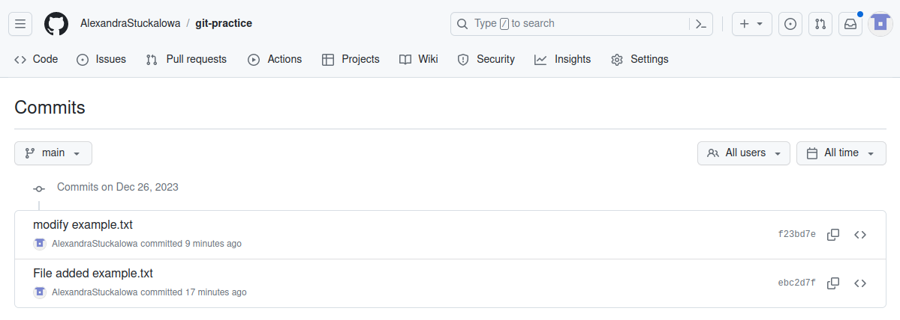

# Лабораторная работа №5.

## Введение.
Cоздала новый репозиторий с именем "git-practice". Склонировала его. Создала файл  "example.txt", в который ввела структуру книги.

Далее добавила файл в индекс гита, создала коммит и отправила его в репозиторий:


Создала новую ветку "feature-branch". Переключилась на нее. В файл "example.txt" добавила текст и создала коммит на этой ветке:


Переключилась обратно в основную ветку и перенесла изменения из ветки feature-branch в основную:


Проверила, что изменения успешно перенеслись в основную ветку:


## Работа с ветками


Создала текстовый файл с базовой структурой книги:


Создала ветку "feature-login" для разработки новой функциональности, внесла изменения в файл. Закоммитила их и отправила ветку на GitHub:


## Работа с удаленным репозиторием

Вернулась на основную ветку и внесла изменения в описании книги.


Закоммитила их и отправила на GitHub:


## Моделирование конфликта

 Перешла в ветку "feature-login" и изменила главу 2 в файле.
 

 Закоммитила изменения и отправила их на GitHub:


## Разрешение конфликта

При возвращении в основную ветку и попытке слить изменения возникает конфликт:


Разрешаю его в файле (удаляю метки и оставляю нужные изменения):


Создаю коммит и отправляю изменения на Github:


## Автоматизация проверки формата файлов при коммите


  * Создайте bash-скрипт (например, check_format.sh), который будет выполнять проверку формата .txt файлов. Этот скрипт может использовать инструменты, такие как grep или другие, чтобы проверить соответствие формату.

  ```
  #!/bin/bash

# Нам нужны файлы, которые не содержат цифры (такой формат)
# Получаем список .txt файлов в текущей директории
files=$(ls *.txt 2>/dev/null)

# Цикл по всем .txt файлам
for file in $files; do
  # Используем grep для поиска нечётных цифр в файле
  grep -q '[13579]' "$file"

  # Проверяем статус выполнения предыдущей команды
  if [ $? -eq 0 ]; then
    echo "Файл $file не соответствует формату."
  else
    echo "Файл $file соответствует формату."
  fi
done
  ```
  
* Добавление скрипта в репозиторий.
    Поместите скрипт в папку, например, в .git/hooks и назовите его pre-commit. Убедитесь, что у него есть права на выполнение.

    ```
    cp check_format.sh .git/hooks/pre-commit
    chmod +x .git/hooks/pre-commit

    ```

  * Попробуйте внести изменения и закоммитить.

    Теперь, при каждой попытке закоммитить изменения, Git будет автоматически выполнять проверку формата файлов перед коммитом. 


## Использование Git Flow в проекте

Я установила Git Flow:


В корне репозитория выполнила инициализацию Git Flow:


Создала ветку для новой функциональности "task-management":


Внесла изменения в код для добавления функционала управления задачами в файл task_manager.py:


Выполнила коммит изменения по мере разработки:


После завершения разработки функции завершила фичу и объединила ее с основной веткой:


Переключилась на ветку "develop" и начала создание релиза:


Внесла изменения, связанные с релизом: обновила версию в файле version.txt:


Завершила релиз и объединила его с ветками "develop" и "main":


Отправила изменения на удаленный репозиторий:
